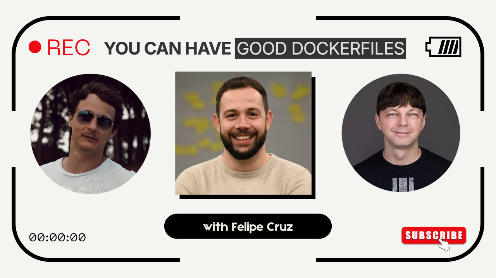

# Dockerfile Reviews

If you have a Dockerfile you'd like to improve or if you'd like to share a good Dockerfile you have or discovered submit it here for us to review:  https://GoodDockerfiles.com

## Ivan and Kyle Are reviewing a Golang app Dockerfile for "gofile" with Felipe Cruz

YouTube Stream: https://www.youtube.com/watch?v=v5E-enT_pyo

We reviewed the "gofile" ( https://github.com/felipecruz91/gofile ) application Felipe created and its Dockerfile ( https://github.com/felipecruz91/gofil... ). The existing Dockerfile is interesting for a number of reasons. It has a number of good qualities we'll call out and discuss in addition to discussing what kind of improvements to make and what kind of gotchas to watch out for.

[Additional notes, references and alternative Dockerfiles](./gofile_golang_app_dockerfile)
